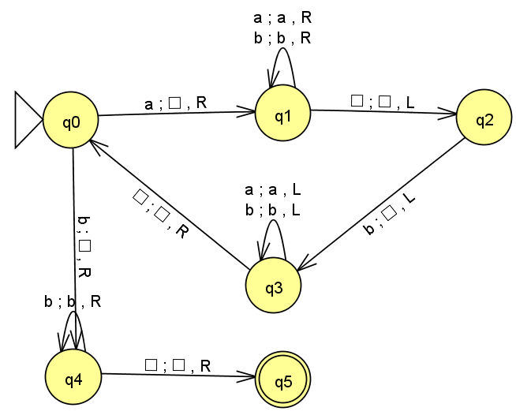
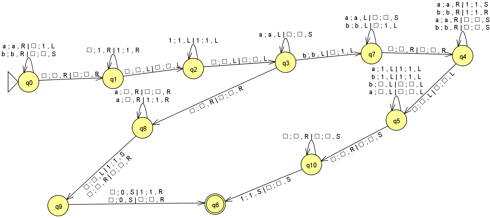

# PRÁCTICA 3: Programar un simulador de una Máquina de Turing determinista
## Aday Cuesta Correa - alu0101483887

## Objetivo
El objetivo de la práctica consiste en programar un simulador de una Máquina de Turing, realizando un diseño orientado a objetos.

## Máquina de Turing implementada
Para la implementación de la máquina de Turing he elegido las siguientes opciones:
- Máquina de Turing con escritura y movimientos simultáneos.
- Máquina de Turing donde los movimientos sean izquierda (L), derecha (R) y no movimiento (S).
- Máquina de Turing con cinta infinita en ambas direcciones.

## Formato del fichero JSON
A continuación aquí tenemos un ejemplo de como debe verse el fichero **json** para máquinas con una sola cinta:

```json
{
    "comments": [
        "Ejemplo de una MT",
        "Reconoce cadenas binarias con un número impar de 0"
    ],
    "states": ["q0", "q1", "q2"],
    "input_alphabet": ["0", "1"],
    "tape_alphabet": ["0", "1", "."],
    "initial_state": "q0",
    "blank_symbol": ".",
    "final_states": ["q2"],
    "transitions": [
        {"current_state": "q0", "read_symbol": "0", "next_state": "q1", "write_symbol": "0", "move_direction": "R"},
        {"current_state": "q0", "read_symbol": "1", "next_state": "q0", "write_symbol": "1", "move_direction": "R"},
        {"current_state": "q1", "read_symbol": "0", "next_state": "q0", "write_symbol": "0", "move_direction": "R"},
        {"current_state": "q1", "read_symbol": "1", "next_state": "q1", "write_symbol": "1", "move_direction": "R"},
        {"current_state": "q1", "read_symbol": ".", "next_state": "q2", "write_symbol": ".", "move_direction": "R"}
    ]
}
```

Por otro lado, para máquinas de Turing con 2 o más cintas debe verse así:

```json
{
  "comments": [
    "Máquina de Turing Multicinta, copia el contenido de la primera cinta a la segunda"
  ],
  "states": ["q0", "q1", "q2", "q3"],
  "input_alphabet": ["0", "1"],
  "tape_alphabet": [".", "0", "1"],
  "initial_state": "q0",
  "blank_symbol": ".",
  "final_states": ["q3"],
  "number_of_tapes": 2,
  "transitions": [
      {"current_state": "q0", "read_symbols": ["0", "."], "next_state": "q1", "write_symbols": ["0", "0"], "move_directions": ["R", "R"]},
      {"current_state": "q0", "read_symbols": ["1", "."], "next_state": "q1", "write_symbols": ["1", "1"], "move_directions": ["R", "R"]},
      {"current_state": "q0", "read_symbols": [".", "."], "next_state": "q3", "write_symbols": [".", "."], "move_directions": ["S", "S"]},
      {"current_state": "q1", "read_symbols": ["0", "."], "next_state": "q1", "write_symbols": ["0", "0"], "move_directions": ["R", "R"]},
      {"current_state": "q1", "read_symbols": ["1", "."], "next_state": "q1", "write_symbols": ["1", "1"], "move_directions": ["R", "R"]},
      {"current_state": "q1", "read_symbols": [".", "."], "next_state": "q2", "write_symbols": [".", "."], "move_directions": ["L", "L"]},
      {"current_state": "q2", "read_symbols": ["0", "0"], "next_state": "q2", "write_symbols": ["0", "0"], "move_directions": ["L", "L"]},
      {"current_state": "q2", "read_symbols": ["1", "1"], "next_state": "q2", "write_symbols": ["1", "1"], "move_directions": ["L", "L"]},
      {"current_state": "q2", "read_symbols": [".", "."], "next_state": "q3", "write_symbols": [".", "."], "move_directions": ["S", "S"]}
  ]
}
```

## Máquinas de Turing a diseñar:
1. **MT que reconozca el lenguaje $L = \{ a^nb^m\ |\ m > n,\ n ≥ 0 \}$**



Su formato json sería el siguiente:

```json
{
  "comments": [
      "MT que reconozca el lenguaje L = { a^nb^m | m > n, n ≥ 0 }"
  ],
  "states": ["q0", "q1", "q2", "q3", "q4", "q5"],
  "input_alphabet": ["a", "b"],
  "tape_alphabet": ["a", "b", "."],
  "initial_state": "q0",
  "blank_symbol": ".",
  "final_states": ["q5"],
  "transitions": [
      {"current_state": "q0", "read_symbol": "a", "next_state": "q1", "write_symbol": ".", "move_direction": "R"},
      {"current_state": "q0", "read_symbol": "b", "next_state": "q4", "write_symbol": ".", "move_direction": "R"},
      {"current_state": "q1", "read_symbol": "a", "next_state": "q1", "write_symbol": "a", "move_direction": "R"},
      {"current_state": "q1", "read_symbol": "b", "next_state": "q1", "write_symbol": "b", "move_direction": "R"},
      {"current_state": "q1", "read_symbol": ".", "next_state": "q2", "write_symbol": ".", "move_direction": "L"},
      {"current_state": "q2", "read_symbol": "b", "next_state": "q3", "write_symbol": ".", "move_direction": "L"},
      {"current_state": "q3", "read_symbol": "a", "next_state": "q3", "write_symbol": "a", "move_direction": "L"},
      {"current_state": "q3", "read_symbol": "b", "next_state": "q3", "write_symbol": "b", "move_direction": "L"},
      {"current_state": "q3", "read_symbol": ".", "next_state": "q0", "write_symbol": ".", "move_direction": "R"},
      {"current_state": "q4", "read_symbol": "b", "next_state": "q4", "write_symbol": "b", "move_direction": "R"},
      {"current_state": "q4", "read_symbol": ".", "next_state": "q5", "write_symbol": ".", "move_direction": "R"}
  ]
}
```

2. **MT que reciba como parámetro una cadena compuesta por símbolos ‘a’ y ‘b’. La MT debe sustituir la cadena por el número de símbolos ‘b’, seguido del número de símbolos ‘a’ separados por un símbolo blanco. El número se codificará como $n\ =\ 1^n$**



Su formato json sería:
```json
{
  "comments": [
    "MT que reciba como parámetro una cadena compuesta por símbolos ‘a’ y ‘b’.",
    "La MT debe sustituir la cadena por el número de símbolos ‘b’,",
    "seguido del número de símbolos ‘a’ separados por un símbolo blanco.",
    "El número se codificará como n = 1^n."
  ],
  "states": ["q0", "q1", "q2", "q3", "q4", "q5", "q6", "q7", "q8", "q9"],
  "input_alphabet": ["a", "b"],
  "tape_alphabet": [".", "0", "1", "a", "b"],
  "initial_state": "q0",
  "blank_symbol": ".",
  "final_states": ["q6"],
  "number_of_tapes": 2,
  "transitions": [
      {"current_state": "q0", "read_symbols": ["b", "."], "next_state": "q0", "write_symbols": ["b", "."], "move_directions": ["R", "S"]},
      {"current_state": "q0", "read_symbols": ["a", "."], "next_state": "q0", "write_symbols": ["a", "1"], "move_directions": ["R", "L"]},
      {"current_state": "q0", "read_symbols": [".", "."], "next_state": "q1", "write_symbols": [".", "."], "move_directions": ["R", "R"]},
      {"current_state": "q1", "read_symbols": [".", "1"], "next_state": "q1", "write_symbols": ["1", "1"], "move_directions": ["R", "R"]},
      {"current_state": "q1", "read_symbols": [".", "."], "next_state": "q2", "write_symbols": [".", "."], "move_directions": ["L", "L"]},
      {"current_state": "q2", "read_symbols": ["1", "1"], "next_state": "q2", "write_symbols": ["1", "1"], "move_directions": ["L", "L"]},
      {"current_state": "q2", "read_symbols": [".", "."], "next_state": "q3", "write_symbols": [".", "."], "move_directions": ["L", "L"]},
      {"current_state": "q3", "read_symbols": ["a", "."], "next_state": "q3", "write_symbols": ["a", "."], "move_directions": ["L", "S"]},
      {"current_state": "q3", "read_symbols": ["b", "."], "next_state": "q7", "write_symbols": ["b", "1"], "move_directions": ["L", "L"]},
      {"current_state": "q3", "read_symbols": [".", "."], "next_state": "q8", "write_symbols": [".", "."], "move_directions": ["R", "R"]},
      {"current_state": "q4", "read_symbols": ["b", "."], "next_state": "q4", "write_symbols": ["b", "."], "move_directions": ["R", "S"]},
      {"current_state": "q4", "read_symbols": ["a", "."], "next_state": "q4", "write_symbols": ["a", "."], "move_directions": ["R", "S"]},
      {"current_state": "q4", "read_symbols": ["b", "1"], "next_state": "q4", "write_symbols": ["b", "1"], "move_directions": ["R", "R"]},
      {"current_state": "q4", "read_symbols": ["a", "1"], "next_state": "q4", "write_symbols": ["a", "1"], "move_directions": ["R", "S"]},
      {"current_state": "q4", "read_symbols": [".", "."], "next_state": "q5", "write_symbols": [".", "."], "move_directions": ["L", "L"]},
      {"current_state": "q5", "read_symbols": ["a", "."], "next_state": "q5", "write_symbols": [".", "."], "move_directions": ["L", "L"]},
      {"current_state": "q5", "read_symbols": ["b", "."], "next_state": "q5", "write_symbols": [".", "."], "move_directions": ["L", "L"]},
      {"current_state": "q5", "read_symbols": ["b", "1"], "next_state": "q5", "write_symbols": ["1", "1"], "move_directions": ["L", "L"]},
      {"current_state": "q5", "read_symbols": ["a", "1"], "next_state": "q5", "write_symbols": ["1", "1"], "move_directions": ["L", "L"]},
      {"current_state": "q5", "read_symbols": [".", "."], "next_state": "q6", "write_symbols": [".", "."], "move_directions": ["R", "R"]},
      {"current_state": "q7", "read_symbols": ["b", "."], "next_state": "q7", "write_symbols": ["b", "1"], "move_directions": ["L", "L"]},
      {"current_state": "q7", "read_symbols": ["a", "."], "next_state": "q7", "write_symbols": ["a", "."], "move_directions": ["L", "S"]},
      {"current_state": "q7", "read_symbols": [".", "."], "next_state": "q4", "write_symbols": [".", "."], "move_directions": ["R", "R"]},
      {"current_state": "q8", "read_symbols": ["a", "1"], "next_state": "q8", "write_symbols": [".", "1"], "move_directions": ["R", "R"]},
      {"current_state": "q8", "read_symbols": ["a", "."], "next_state": "q8", "write_symbols": [".", "."], "move_directions": ["R", "R"]},
      {"current_state": "q8", "read_symbols": [".", "1"], "next_state": "q9", "write_symbols": [".", "1"], "move_directions": ["L", "S"]},
      {"current_state": "q9", "read_symbols": [".", "1"], "next_state": "q4", "write_symbols": ["0", "1"], "move_directions": ["L", "R"]}
  ]
}
```

## Como Compilar y Ejecutar el Programa
Gracias al archivo makefile la compilación del programa es sencilla, tan solo escriba en la consola:

```bash
make
```

Y se creará el ejecutable del programa, para utilizar el programa hay que ejecutar:

```bash
./TuringMachine <Nombre_Del_Archivo_Con_El_Autómata>
```

Un ejemplo sería:

```bash
./TuringMachine Examples/Ejercicio1.json
```

Si tiene dudas de como funciona el programa siempre puede escribir:

```bash
./TuringMachine -h
```

Para limpiar el directorio (eliminar el ejecutable y los archivos .o) escriba:

```bash
make clean
```